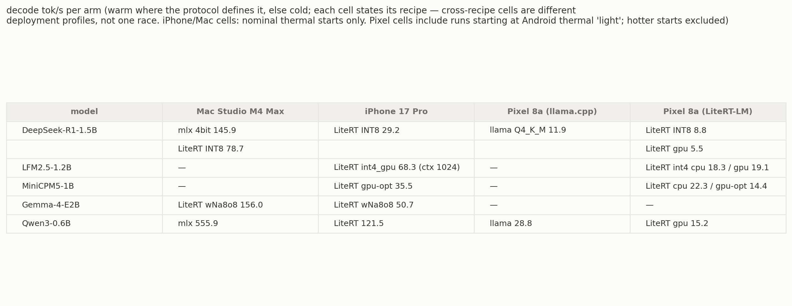

# edge-llm-bench

A neutral, reproducible benchmark harness for local LLM engines on real
devices — built to run continuously, not as one-off campaigns.

- **Engines**: LiteRT-LM, llama.cpp, MLX, Apple Core AI, Cactus — every pin
  lives in `environment.lock.json`
- **Devices**: Mac Studio (M4 Max), iPhone 17 Pro, Pixel 8a, Galaxy S26 —
  one schema (`schema/result.v1.json`), one accumulation layer, one
  leaderboard



Full standings, including the Galaxy S26 rows: [`LEADERBOARD.md`](LEADERBOARD.md).

## The loop

```bash
./bench release-watch        # upstream releases vs environment.lock.json pins
./bench matrix  matrices/apple-warm-matrix.cells
./bench regress matrices/release-regression-litert.cells \
    --engine litert-lm --version v0.16.0 --baseline engine:v0.15.0
```

Adding a model is one line in a cells file. This exact line is behind the
Pixel 8a LFM2.5 gpu rows:

```
android litert-lm litert-community/LFM2.5-1.2B-Instruct short-chat backend=gpu file=LFM2.5-1.2B-Instruct_int4_gpu.litertlm
```

Every run emits schema-v1 JSON per record plus its raw console log
(`results/raw/<campaign>/`) — a number without a stored report is not a
measurement. `results/summary/*.csv` is the derived accumulation layer;
[`LEADERBOARD.md`](LEADERBOARD.md) renders from it; regression verdicts
persist as machine-readable JSON under `results/regression-reports/`. CI
keeps all of it consistent.

**Operating manual** — release regressions, adding a model / arm / device,
what stays manual and why: [`docs/OPERATIONS.md`](docs/OPERATIONS.md).

## What keeps the numbers honest

- **The recipe is part of every row.** Arms run their own best available
  build; quantization and engine pin sit in the row because a faster number
  under a different recipe is a different deployment profile, not a win.
  "int4" is not a spec — Gemma-4 `.litertlm` is the wNa8o8 mobile schema and
  is labeled as such.
- **Wide trial spread throws the cell out.** Trials that disagree come back
  UNRELIABLE instead of scored.
- **Failed runs stay in the table.** Crashes, OOMs, and unsupported configs
  keep their row; the reason is the datum.
- **Cross-session deltas only count through session anchors.** Devices drift
  between sittings, so every session runs an anchor cell first and deltas
  are normalized through it.
- **Mismatched budgets or modes refuse to score.**

Full rules, cited by slug from the code: [`methodology/fairness-rules.md`](methodology/fairness-rules.md).

## Coverage

**measured** = rows in the leaderboard today. **wired** = the arm builds at
its pinned version but has no published rows yet. **n/a** always carries its
reason — that is part of the method, not an apology.

| engine | Mac Studio (M4 Max) | iPhone 17 Pro | Pixel 8a | Galaxy S26 |
|---|---|---|---|---|
| LiteRT-LM | measured | measured | measured (cpu, gpu) | measured (cpu, gpu) |
| llama.cpp | wired | wired | measured (cpu) | measured (cpu) |
| MLX | measured | measured | n/a — Apple-only | n/a — Apple-only |
| Core AI | wired (external runner) | measured | n/a — Apple-only | n/a — Apple-only |
| Cactus | n/a — no Mac arm | wired | planned | planned |

- Android LiteRT NPU is n/a on both devices — the NPU path is Early Access
  only (`methodology/android.md`).
- Android llama.cpp is the official CPU release binary at the same tag as
  the Apple arm; GPU would need a custom NDK build and is a disclosed gap.
- Android v1 has no warm regime and no TTFT on llama-cli; every disclosed
  deviation is in `methodology/android.md`.
- Mac Core AI has no rows because the pinned 0.2.0 release does not run on
  the bench Mac's macOS 27 beta (`environment.lock.json`).
- The Core AI arm is best-effort: Gemma-4-class PLE models need an
  unpublished engine patch (`COREAI_STATIC_INPUTS`); a clean clone reports
  `unsupported`. Missing exports stay visible as reasoned rows (DeepSeek-R1
  1.5B: bundle pending export).
- Cactus Android is a phase-2 slot at the pinned commit; until then the
  driver reports the row with its reason.
- Energy cells are manual by design (battery-delta needs the cable out).

## Seed baseline

This repo starts with the 2026-08-17 LiteRT-LM v0.15.0 → v0.16.0 regression
run as its founding baseline: Pixel 8a (Android lane) and Mac Studio M4 Max,
verdicts in `results/regression-reports/`. On the Pixel GPU the release is a
clean pass (decode +0.3%); on the Mac, Qwen3-0.6B decode improved ~14% over
the July v0.13.1 rows (anchor-normalized) and Gemma-4-E2B stayed flat.

## Provenance

The harness was carved out of
[apple-silicon-llm-bench](https://github.com/john-rocky/apple-silicon-llm-bench),
which remains the measurement archive (published campaign tables, full raw
history back to 2026-05, and the `./reproduce` registry mapping each
published table to its pinned command). Numbers in that archive were
measured with the same harness code; this repo is canonical for the harness
going forward.

License: MIT.
